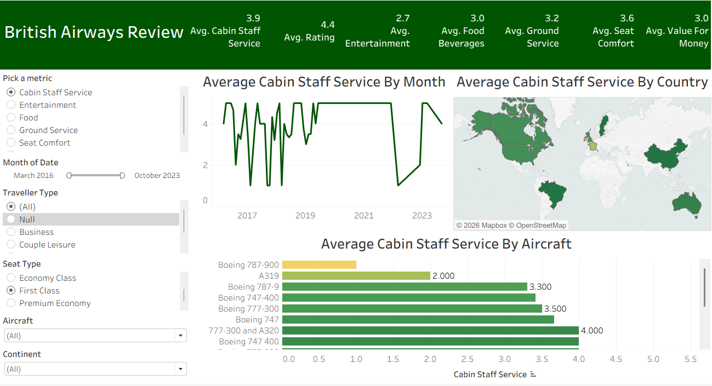

# ✈️ British Airways Reviews Dashboard (Tableau)

## 📊 Overview
This project presents an interactive Tableau dashboard analyzing customer reviews of British Airways.

The goal is to explore customer satisfaction across different service dimensions, time, geography, and aircraft types.

---

## 🎯 Objectives
- Analyze customer ratings across multiple service categories
- Identify trends over time
- Compare performance across countries and aircraft types
- Enable dynamic metric selection using parameters

---

## 📌 Key Features
- Dynamic metric selection (parameter-driven analysis)
- KPI summary (rating, staff service, entertainment, etc.)
- Time series analysis (monthly trends)
- Geographic visualization (average rating by country)
- Aircraft comparison (bar chart)
- Interactive filters (traveller type, seat type, date, continent)

---

## 🛠️ Tools Used
- Tableau (Data Visualization)
- CSV datasets

---

## 📷 Dashboard Preview

---

## 🚀 How to Use
1. Open the `.twbx` file in Tableau
2. Interact with filters and parameter controls
3. Explore insights across different dimensions

---

## 📈 Insights (Example)
- Cabin staff service shows variability across time
- Certain aircraft types consistently receive higher ratings
- Geographic differences highlight varying customer satisfaction levels

---

## 🌐 Live Dashboard
[View on Tableau Public](https://public.tableau.com/shared/B9ZKX7KMN?:display_count=n&:origin=viz_share_link)

## 👤 Author
Anastasios Saliaris
